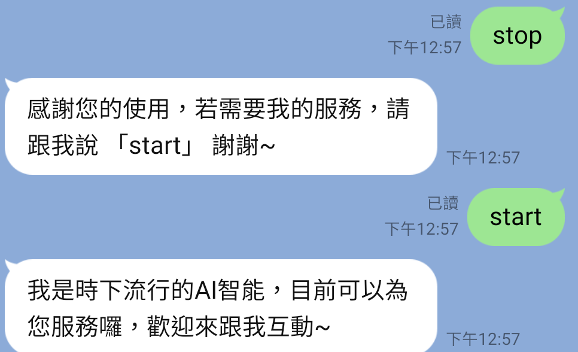
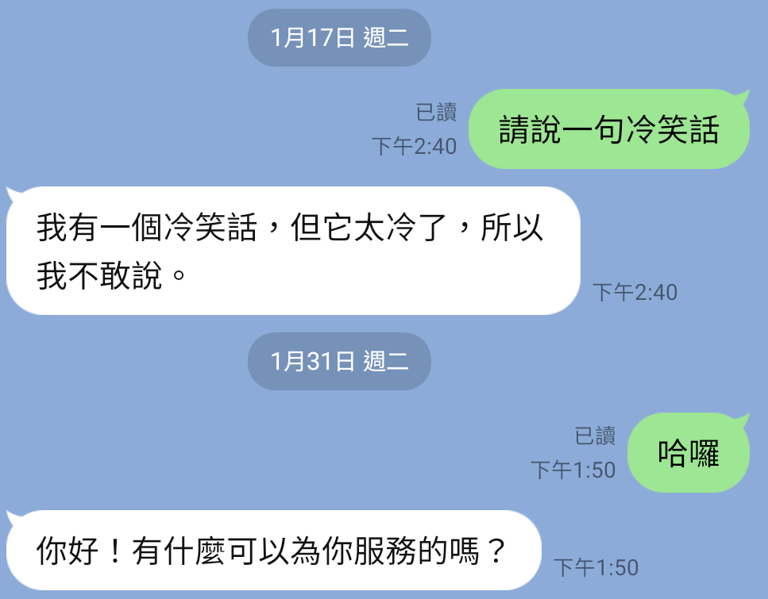

# LINE BOT 智能聊天機器人

### 說明
使用OpenAi - text-davinci-003 串接 LineBot 製作出一個小型聊天機器人，
使使用者可在Line上即可跟chatgpt互動，而不用至網頁上使用。

### 使用技術
| 程式語言     | 框架    |
|:-------|-------|
| Python | Flask |

| API      | 
|:--------|
| OpenAI  |
| LineBot |

### 成果展示

### 線上學習網址
1. [茶米老師教室－Part1：ChatGPT 與 OpenAI](https://www.youtube.com/watch?v=go7uFUniH1A)
2. [茶米老師教室－Part2：ChatGPT x Colab 實戰](https://www.youtube.com/watch?v=XBSQ1BFoxt0)
